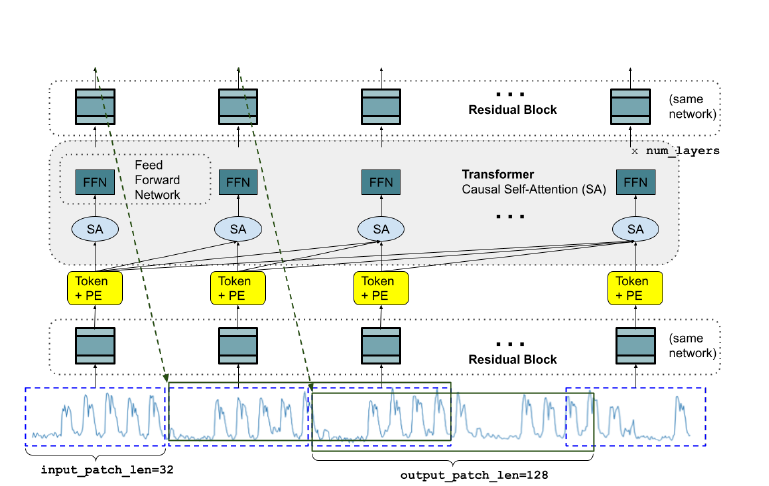

# HuggingFace
A repo to test huggingface with time series forecasting.

The model to be executed is a [pre-trained encoder style attention model with input patching.](https://research.google/blog/a-decoder-only-foundation-model-for-time-series-forecasting/)

Here's the decoder architecture.

